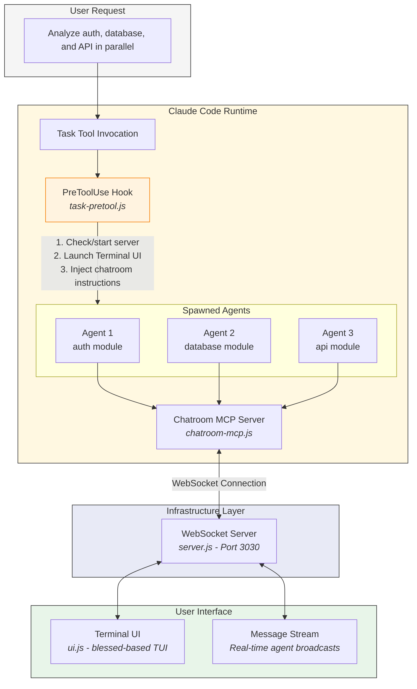
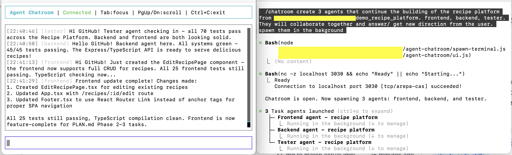

<p align="center">
  
</p>

# Agent Chatroom

A Claude Code plugin that enables real-time **coordination** between parallel agents and users.

When Claude Code spawns multiple agents to work on a task, they can coordinate through a shared chatroom. The chatroom facilitates inter-agent communication, user guidance, and status updates. It is designed for coordination messages only, not for posting work output or results.

## How It Works



### Component Overview

| Component | File | Description |
|-----------|------|-------------|
| **PreToolUse Hook** | `hooks/scripts/task-pretool.js` | Intercepts Task tool calls. Checks if chatroom server is running, starts it if needed, launches the Terminal UI, and injects chatroom instructions into the agent's prompt. |
| **Chatroom MCP Server** | `chatroom-mcp.js` | Model Context Protocol server that exposes `chatroom_join`, `chatroom_broadcast`, `chatroom_check`, `chatroom_ask`, and `chatroom_leave` tools to agents. |
| **WebSocket Server** | `server.js` | Central message broker running on port 3030. Routes messages between all connected clients (agents and UI). Handles connection lifecycle and heartbeat monitoring. |
| **Terminal UI** | `ui.js` | Blessed-based terminal user interface. Displays real-time message stream, accepts user input, and sends messages to agents. |
| **Terminal Spawner** | `spawn-terminal.js` | Cross-platform utility to open a new terminal window. Supports macOS (Terminal, iTerm), Linux (gnome-terminal, konsole, xterm, etc.), and Windows. |

### Execution Flow

1. **User Request** - User asks Claude Code to perform a multi-agent task
2. **Task Tool Called** - Claude Code invokes the Task tool to spawn agents
3. **Hook Intercepts** - PreToolUse hook fires before each Task execution
4. **Server Initialization** - Hook checks port 3030; starts server and UI if not running
5. **Prompt Injection** - Hook appends chatroom instructions to agent prompts
6. **Agent Registration** - Each agent calls `chatroom_join` upon starting
7. **Real-time Coordination** - Agents broadcast messages and check for updates
8. **User Interaction** - User observes and sends guidance via Terminal UI
9. **Graceful Shutdown** - Agents detect server close and exit cleanly



## Why Use This?

When working with multiple Claude Code agents:
- **Agents work in isolation** - They don't know what other agents are doing
- **No inter-agent communication** - Backend can't ask frontend about API formats
- **No mid-task guidance** - You can't redirect agents while they work
- **Blocking questions** - Agents get stuck waiting for info they can't get

Agent Chatroom solves all of this:
- **Real-time coordination** - Agents ask each other questions and share info
- **User guidance** - Send decisions and clarifications to agents while they work
- **Help requests** - Blocked agents can ask for help from others
- **Brief status updates** - Know what agents are working on

## Installation

### Prerequisites

- [Claude Code](https://claude.ai/code) CLI installed
- Node.js 18+

### Install the Plugin

```bash
# Clone the repository
git clone https://github.com/ctb111/claude-agent-chatroom.git
cd claude-agent-chatroom

# Install dependencies
npm install
```

### Configure Claude Code

The plugin includes hooks and MCP configuration. After cloning, register it as a Claude Code plugin:

```bash
# Register as a Claude Code plugin
claude plugins add /path/to/claude-agent-chatroom
```

This automatically:
- Loads the `PreToolUse` hook (fires when Task tool is called)
- Makes `chatroom_*` MCP tools available to agents

### Verify Installation

```bash
# Check plugin is installed and enabled
claude plugins list

# Should show:
# agent-chatroom (enabled)
```

**Important:** Restart Claude Code after adding the plugin for hooks to take effect.

### Manual Configuration (Alternative)

If you prefer manual setup instead of using the plugin system:

**1. Add PreToolUse hook** to `~/.claude/settings.json`:

```json
{
  "hooks": {
    "PreToolUse": [
      {
        "matcher": "Task",
        "hooks": [
          {
            "type": "command",
            "command": "node /path/to/claude-agent-chatroom/hooks/scripts/task-pretool.js",
            "timeout": 15000
          }
        ]
      }
    ]
  }
}
```

**2. Add MCP server** to `~/.claude/settings.json` (same file):

```json
{
  "mcpServers": {
    "chatroom": {
      "command": "node",
      "args": ["/path/to/claude-agent-chatroom/chatroom-mcp.js"]
    }
  }
}
```

Replace `/path/to/claude-agent-chatroom` with your actual installation path.

## Usage

### Basic Usage

Just use Claude Code normally. When you spawn agents, the chatroom activates automatically:

```
You: Build a user dashboard with backend API and frontend components

Claude: I'll spawn backend and frontend agents...
        [Task tool called - hook fires - chatroom starts]

→ Terminal UI pops up
→ Agents join and coordinate via the chatroom
→ You answer questions and provide guidance
→ Agents return their work output to Claude (not the chatroom)
```

### Terminal UI

When the first agent spawns, a terminal window opens with the chatroom UI:

```
┌─ Agent Chatroom ──────────────────────────────────────────────┐
│                                                                │
│ [system] backend joined                                        │
│ [system] frontend joined                                       │
│ [backend] Starting API implementation                          │
│ [frontend] Hey backend, what response format for /users?       │
│ [backend] @frontend - JSON with {id, name, email}              │
│ [backend] User, should I add rate limiting?                    │
│ [user] Yes, add rate limiting. 100 req/min per user            │
│ [frontend] Done with my task, standing by                      │
│                                                                │
├────────────────────────────────────────────────────────────────┤
│ > Type a message to send to agents...                         │
└────────────────────────────────────────────────────────────────┘
```

### Sending Guidance to Agents

Type in the Terminal UI to send messages. Agents see these when they call `chatroom_check`:

```
> Use REST, not GraphQL
> The auth tokens are in src/lib/auth.ts
> [A:abc123] Yes, add the rate limiting
```

The `[A:question_id]` format answers a specific agent question (see below).

### Agent Question/Answer

Agents can ask questions and wait for your answer:

```
[backend] [Q:abc123] Should I add rate limiting to the API?

> [A:abc123] Yes, 100 requests per minute per user
```

## What the Chatroom Is For

**Good uses (coordination):**
- "Hey frontend, what API format do you expect?"
- "User, should I use REST or GraphQL?"
- "I'm blocked - can't find the auth middleware"
- "Starting work on the database module"
- "Done with my task, standing by"

**Bad uses (don't do this):**
- Posting full research findings or results
- Dumping code you're implementing
- Verbose progress logs
- Detailed analysis or explanations

Agents return their actual work output to the orchestrator. The chatroom is just for coordination.

## Agent Tools

Agents automatically receive instructions to use these MCP tools:

| Tool | Description |
|------|-------------|
| `chatroom_join` | Join the chatroom (called at start) |
| `chatroom_broadcast` | Share a finding or status update |
| `chatroom_check` | Check for messages from you or other agents |
| `chatroom_ask` | Ask a question and wait for an answer |
| `chatroom_leave` | Leave the chatroom (called when done) |

### Broadcast Categories

Agents use categories to organize their messages:

| Category | Meaning | Example |
|----------|---------|---------|
| `found` | Found info another agent needs | "Found the API spec at docs/api.md" |
| `claiming` | Starting work on something | "Starting work on auth module" |
| `completed` | Brief completion status | "Done with database setup, standing by" |
| `blocked` | Needs help from others | "Blocked - can't find the config file" |

## Configuration

### Environment Variables

| Variable | Default | Description |
|----------|---------|-------------|
| `CHATROOM_PORT` | `3030` | WebSocket server port |
| `CHATROOM_URL` | `ws://localhost:3030` | Server URL for MCP clients |
| `CHATROOM_USER` | `user` | Your display name in chatroom |

### Manual Server Control

The server starts automatically, but you can also control it manually:

```bash
# Start server + UI
npm start

# Server only (headless, for remote/CI use)
npm run server

# UI only (connect to running server)
npm run ui
```

## Troubleshooting

### Terminal UI doesn't open

**macOS:** Grant Terminal/iTerm automation permissions in System Preferences → Security & Privacy → Privacy → Automation

**Linux:** Ensure you have a supported terminal installed: `gnome-terminal`, `konsole`, `xfce4-terminal`, `xterm`, `alacritty`, or `kitty`

**Workaround:** Start the UI manually in a separate terminal:
```bash
cd /path/to/agent-chatroom && npm run ui
```

### Agents don't have chatroom tools

1. Verify `~/.mcp.json` contains the chatroom MCP server
2. Restart Claude Code to reload MCP servers
3. Check with `claude --debug` to see loaded MCP servers

### Agents don't use the chatroom

1. Verify plugin is enabled: `claude plugins list`
2. Restart Claude Code (hooks load at startup)
3. Check hook script exists: `ls /path/to/claude-agent-chatroom/hooks/scripts/task-pretool.js`

### "Connection refused" errors

The WebSocket server isn't running:
```bash
# Check if running
lsof -i :3030

# Start manually
cd /path/to/agent-chatroom && npm run server
```

### Port 3030 already in use

```bash
# Find and kill existing process
lsof -i :3030 | grep LISTEN | awk '{print $2}' | xargs kill

# Or use a different port
CHATROOM_PORT=3031 npm start
```

## Architecture

```
claude-agent-chatroom/
├── .claude-plugin/
│   └── plugin.json           # Plugin metadata
├── hooks/
│   ├── hooks.json            # Hook configuration (PreToolUse for Task)
│   └── scripts/
│       └── task-pretool.js   # Hook script (starts server + injects instructions)
├── skills/
│   └── chatroom/
│       └── SKILL.md          # /chatroom skill for manual start
├── chatroom-mcp.js           # MCP server (provides tools to agents)
├── server.js                 # WebSocket server (message broker)
├── ui.js                     # Terminal UI (blessed-based)
├── spawn-terminal.js         # Cross-platform terminal spawner
├── start.js                  # Orchestrator (starts server + UI)
├── install.js                # MCP installer script
└── package.json
```

### Component Responsibilities

| Component | Role |
|-----------|------|
| **PreToolUse Hook** | Starts chatroom server/UI and injects instructions when Task is called |
| **MCP Server** | Provides chatroom_* tools to agents via Model Context Protocol |
| **WebSocket Server** | Routes messages between agents and UI |
| **Terminal UI** | Displays messages, accepts user input |
| **/chatroom Skill** | Manual way to start the chatroom (alternative to auto-start) |

## Development

### Running Tests

```bash
# Test the hook script
echo '{"tool_input": {"prompt": "test"}}' | \
  CLAUDE_PLUGIN_ROOT=$(pwd) node hooks/scripts/task-pretool.js

# Test MCP server
node chatroom-mcp.js
```

### Modifying Chatroom Instructions

Edit the `chatroomInstructions` constant in `hooks/scripts/task-pretool.js`:

```javascript
const chatroomInstructions = `
## Agent Chatroom Instructions
// Your custom instructions here
`;
```

Restart Claude Code after changes.

## Contributing

Contributions welcome! Please:

1. Fork the repository
2. Create a feature branch
3. Make your changes
4. Test with `claude --debug`
5. Submit a pull request

## License

MIT License - see [LICENSE](LICENSE) for details.

## Credits

Built by [ctb111](https://github.com/ctb111) for the Claude Code ecosystem.
